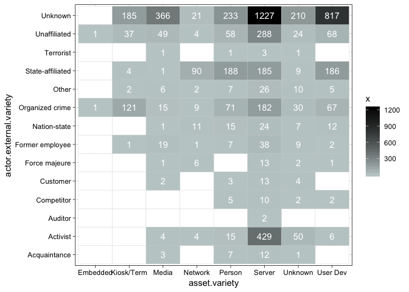

verisr2
=======

This package is to support data analysis within the VERIS framework
(<a href="http://veriscommunity.net" class="uri">http://veriscommunity.net</a>).
It is intended to work directly with raw JSON and can be used against
the VERIS Community Database (VCDB) found at
(<a href="http://veriscommunity.net/doku.php?id=public" class="uri">http://veriscommunity.net/doku.php?id=public</a>)
and
(<a href="https://github.com/vz-risk/VCDB" class="uri">https://github.com/vz-risk/VCDB</a>).

This package has two purposes. First is to convert one or more
directories of VERIS (JSON) files into a usable object (in this version
it is currently a data.table, but I hope to move to a dplyr object).
Second, it offers a set of convenience functions for doing basic
information retrieval from the object.

Install it from straight from github:

``` r
# install devtools from https://github.com/hadley/devtools
devtools::install_github("onlyphantom/verisr2")
```

Load the library and look at the built-in `vcdb` data:

    ## Welcome to verisr2. To transform veris JSON to data frame, use the veris package from https://github.com/vz-risk/verisr. Since the old veris package is no longer maintained, this package is written to add or replace functionalities broken in the old veris package which included many legacy code that has been deprecated.

Inspecting the class and dimensions of the data:

``` r
class(vcdb)
```

    ## [1] "verisr"     "data.frame"

``` r
dim(vcdb)
```

    ## [1] 8198 2436

Using

``` r
getenum_df(vcdb, c("action", "asset.variety"))
```

    ## # A tibble: 64 x 3
    ##    action   asset.variety     x
    ##    <chr>    <chr>         <int>
    ##  1 Hacking  Server         1890
    ##  2 Error    Media          1395
    ##  3 Misuse   Server         1030
    ##  4 Physical User Dev        706
    ##  5 Error    Server          662
    ##  6 Social   Person          554
    ##  7 Physical Media           478
    ##  8 Malware  Server          453
    ##  9 Social   Server          375
    ## 10 Malware  User Dev        371
    ## # … with 54 more rows

Plotting:

``` r
enum2grid(vcdb, c("asset.variety", "actor.external.variety"))
```


