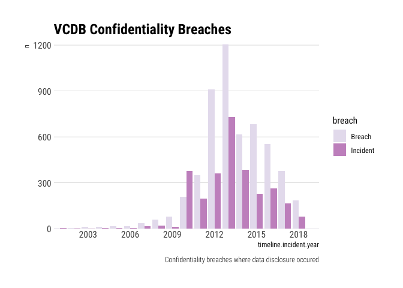

verisr2
=======

Convenience functions for exploratory analysis on VERIS database
(<a href="http://veriscommunity.net" class="uri">http://veriscommunity.net</a>).

Small helper functions for working with the data frame objects from the
[VERIS Community Database (VCDB)](http://veriscommunity.net/vcdb.html),
typically converted from JSON using the
[verisr](https://github.com/vz-risk/verisr) package (or, if unavailable,
from this my fork of [this
package](https://github.com/onlyphantom/verisr)). This package
replicates in base R or dplyr many of the helper functions originally
implemented in the verisr package by Jay Jacobs.

The original package by Jay uses `data.table` code that is deprecated
and no longer works with recent versions of R. The author has stated his
desire to one day rewrite these functions in dplyr code but since effort
on that has been stagnant for a few years now this is a simple attempt
to recreate these helper functions in `dplyr` or base R code.

Installation and Getting Started
--------------------------------

Install it from github and load the built-in dataset:

``` r
# install devtools from https://github.com/hadley/devtools
devtools::install_github("onlyphantom/verisr2")
library(verisr2)
data(vcdb)
```

Inspecting the class of the data:

``` r
class(vcdb)
```

    ## [1] "verisr"     "data.frame"

Because the incidents are originally recorded in JSON, the transformed
data is “wide” spanning across more than 2,430 variables as of this
writing. The VERIS specification has intended for the data schema to be
extended upon, and when expressed as a data frame, this wide format
presents an opportunity for data analysis and exploratory exercises:

``` r
dim(vcdb)
```

    ## [1] 8198 2436

Convenience Functions
---------------------

Retrieve a list of variables (enumeration / factors) in the data frame
from a specified “parent”:

``` r
getenum_stri(vcdb, "action.error.vector")[1:5]
```

    ## [1] "action.error.vector.Carelessness"         
    ## [2] "action.error.vector.Inadequate personnel" 
    ## [3] "action.error.vector.Inadequate processes" 
    ## [4] "action.error.vector.Inadequate technology"
    ## [5] "action.error.vector.Other"

The same function can also be performed with a vector of (character)
strings instead of a single string value:

``` r
getenum_stri(vcdb, c("actor.internal.motive", "value_chain.money laundering.variety"))[8:12]
```

    ## [1] "actor.internal.motive.NA"                 
    ## [2] "actor.internal.motive.Other"              
    ## [3] "actor.internal.motive.Secondary"          
    ## [4] "actor.internal.motive.Unknown"            
    ## [5] "value_chain.money laundering.variety.Bank"

To get a frequency table, use `getenum_tbl`:

``` r
getenum_tbl(vcdb, c("action", "asset.variety"))
```

    ##           action.Malware           action.Hacking            action.Social 
    ##                      678                     2185                      554 
    ##          action.Physical            action.Misuse             action.Error 
    ##                     1565                     1675                     2374 
    ##     action.Environmental           action.Unknown     asset.variety.Server 
    ##                        8                      237                     3819 
    ##    asset.variety.Network   asset.variety.User Dev      asset.variety.Media 
    ##                      157                     1478                     2207 
    ##     asset.variety.Person asset.variety.Kiosk/Term    asset.variety.Unknown 
    ##                      606                      345                      646 
    ##   asset.variety.Embedded 
    ##                        2

We can use `getenum_df` function to get both the count and the
proportion of assets where data loss has occured. This replicates the
original functionality from `jayjacobs` and `vz-risk`’s version but uses
base R in its underlying function:

``` r
getenum_df(vcdb, "asset.variety")
```

    ##         enum    x    n    freq
    ## 1     Server 3819 8188 0.46641
    ## 2      Media 2207 8188 0.26954
    ## 3   User Dev 1478 8188 0.18051
    ## 4     Person  606 8188 0.07401
    ## 5 Kiosk/Term  345 8188 0.04213
    ## 6    Network  157 8188 0.01917
    ## 7   Embedded    2 8188 0.00024
    ## 8    Unknown  646   NA      NA

Similarly, we can pass in a vector of two characters to the function,
which will count the number of incidents across the two enumerations:

``` r
getenum_df(vcdb, c("action", "asset.variety"))
```

    ## # A tibble: 64 x 3
    ##    action   asset.variety     x
    ##    <chr>    <chr>         <int>
    ##  1 Hacking  Server         1890
    ##  2 Error    Media          1395
    ##  3 Misuse   Server         1030
    ##  4 Physical User Dev        706
    ##  5 Error    Server          662
    ##  6 Social   Person          554
    ##  7 Physical Media           478
    ##  8 Malware  Server          453
    ##  9 Social   Server          375
    ## 10 Malware  User Dev        371
    ## # … with 54 more rows

`enum2grid` replicates the plotting function in `jayjacobs` version, and
will work with all recent versions of R:

``` r
enum2grid(vcdb, c("asset.variety", "actor.external.variety"))
```


Another example:

``` r
enum2grid(vcdb, c("action", "asset.variety"))
```


`importveris()` is a thin wrapper over the `json2veris()` function. In
later versions of vcdb incidents, the original function may result in a
dataframe where one or more of its variables is another level of nested
list object(s). This function eliminates these columns, so they’re in a
more ready state for most data analysis tasks:

``` r
vcdb_small <- importveris("~/Datasets/vcdb_small/")
```

    ## [1] "veris dimensions"
    ## [1]    0 2437
    ## named integer(0)
    ## named integer(0)

Transform VCDB to a tidyverse-esque data frame
----------------------------------------------

`collapse_vcdb()` takes a `vcdb` data frame and turns it into a more
compact data frame that conforms to the “tidyverse” specifications. New
features are created from the original data, using values that best
represent each enumeration. An oversimplified diagram explaining this
process is as follow: 

``` r
tidy_vcdb <- collapse_vcdb(vcdb)
str(tidy_vcdb)
```

    ## Loading verisr2

    ## 'data.frame':    8198 obs. of  15 variables:
    ##  $ action                      : Factor w/ 9 levels "Environmental",..: 5 7 2 3 2 2 3 3 7 6 ...
    ##  $ action.environmental.notes  : chr  NA NA NA NA ...
    ##  $ action.environmental.variety: Factor w/ 4 levels "Fire","Humidity",..: 4 4 4 4 4 4 4 4 4 4 ...
    ##  $ action.error.notes          : chr  NA NA NA NA ...
    ##  $ action.error.variety        : Factor w/ 18 levels "Capacity shortage",..: 18 18 6 18 10 10 18 18 18 18 ...
    ##  $ action.error.vector         : Factor w/ 8 levels "Carelessness",..: 8 8 8 8 1 1 8 8 8 8 ...
    ##  $ action.hacking.cve          : chr  NA NA NA NA ...
    ##  $ action.hacking.notes        : chr  NA NA NA NA ...
    ##  $ action.hacking.result       : Factor w/ 5 levels "Elevate","Exfiltrate",..: 5 5 5 5 5 5 5 5 5 5 ...
    ##  $ action.hacking.variety      : Factor w/ 8 levels "Brute force",..: 6 6 6 5 6 6 6 6 6 6 ...
    ##  $ action.hacking.vector       : Factor w/ 11 levels "Backdoor or C2",..: 9 9 9 11 9 9 11 11 9 9 ...
    ##  $ action.malware.cve          : chr  NA NA NA NA ...
    ##  $ action.malware.name         : chr  NA NA NA NA ...
    ##  $ action.malware.notes        : chr  NA NA NA NA ...
    ##  $ action.malware.result       : Factor w/ 5 levels "Elevate","Exfiltrate",..: 5 5 5 5 5 5 5 5 5 5 ...

Note that the new data frame is a lot more compact, with 175 instead of
the original 2,430+ variables:

``` r
dim(tidy_vcdb)
```

    ## [1] 8198  175

Where the original VCDB has a shape that resembles a “sparse matrix”,
this new “tidy” data frame now has most variables as factor and numeric
values. Obviously some loss of fidelity happens (a 2500-column data
matrix where most values are 0 are reduced to 175-column where only the
representative value is stored in each dimension / enumeration):

    ## 
    ## c("ordered", "factor")              character                 factor 
    ##                      1                     59                    105 
    ##                numeric 
    ##                     10

Combining with `ggplot2`
------------------------

The data (both the originalo `vcdb` and its tidy variant) also works
well with the rest of `tidyverse`. An example is to use the data in
conjunction with `dplyr` and `ggplot2`:

``` r
vcdb %>%
  group_by(attribute.confidentiality.data_disclosure.Yes) %>%
  dplyr::count(timeline.incident.year) %>%
  ungroup() %>% 
  mutate(
    breach = ifelse(attribute.confidentiality.data_disclosure.Yes, 
                    "Breach", "Incident")
  ) %>% filter(
    timeline.incident.year > 2000
  ) %>% ggplot(aes(x=timeline.incident.year, y=n, group=breach)) +
  geom_col(aes(fill=breach), position = "dodge") +
  scale_x_continuous(expand=c(0,0), breaks=seq(2000, 2018, 3)) + 
  scale_y_continuous(expand=c(0,0)) + 
  scale_fill_brewer(palette = 11) + 
  labs(title="VCDB Confidentiality Breaches", caption="Confidentiality breaches where data disclosure occured"
```



Country-level investigation
---------------------------

Existing functions in this package already allow us with country-level
inspection pretty effortlessly:

``` r
summary(tidy_vcdb$actor.external.country, maxsum=8)
```

    ##  Unknown       US Multiple       RU       CN       PK       SY  (Other) 
    ##     7320      220      180      110       43       40       36      249

We can use the collapsed dataframe (result of `collapse_vcdb`) to
perform our inspection:

``` r
usvictim <- subset(tidy_vcdb, victim.country=="US")
head(usvictim$notes)
```

    ## [1] "lincoln financial securities Corporation is a subsidiary of Lincoln national Corporation"                                                                
    ## [2] "Limited information provided and there have been no follow-up articles."                                                                                 
    ## [3] "HHS Breach Tool"                                                                                                                                         
    ## [4] "The Sentry email mistake was modeled seperately. "                                                                                                       
    ## [5] "I can't discern who was breached here. It says DoD. But it also says satellite manufacturer. I'm assuming the latter working for DoD"                    
    ## [6] "The final record count was obtained from the HHS Breachtool record for this incident.  It was listed under the partner rather than Owensboro, strangely."

As of version 0.4.0, the new function `involving_country()` allows us to
query even more effectively for all incidents where a specified country
is involved:

``` r
us <- involving_country(data = vcdb, "US")
head(us$discovery_notes)
```

    ## [1] "In June 2014, Epic Systems Corp. in Verona received an email that no software company can ignore: Employees of a company working for one of its customers had gained unauthorized access to a restricted website and may have stolen documents that contained trade secrets."
    ## [2] "actor was arrested on drug charge and they found skimmer and cards, notified employer."                                                                                                                                                                                      
    ## [3] "Committed ID fraud against her own maid of honor and used her real phone number when establishing fraudulent lines of credit."                                                                                                                                               
    ## [4] "the FBI was investigating after 2.5GB of data taken from its servers was dumped online and swiftly shared on social media. The union's national site, fop.net, remained offline on Thursday evening"                                                                         
    ## [5] "Engel said, though, that the university didn’t confirm that data had been breached or learn about its apparent scope until external investigators notified officials July 31, 2018."                                                                                         
    ## [6] "We have disabled the malware and have reconfigured our point-of-sale and payment card processing systems to enhance the security of these systems"

By default, `involving_country` returns all columns of every incident
involving that country. If we would like to retrieve only the columns
where one or more notes are present (discovery notes, incident notes,
impact notes, actor notes etc - more than 30 of such columns), then set
`notes_only` to `TRUE`. The function helpfully drops any incident (rows)
where no notes are present:

``` r
# only notes-type columns
us_small <- involving_country(vcdb, "US", notes_only=TRUE)
dim(us_small)
```

    ## [1] 1928   30

Credits
-------

-   A big appreciation to [Jay Jacobs](https://github.com/jayjacobs) for
    the original `verisr` package. While it hasn’t receive any updates
    in recent years, the project has been a tremendous help and starting
    point.

-   Thanks to the Verizon RISK Team and the community behind The VERIS
    Community Database

-   Thanks to Hadley Wickham, the contributors and all maintainers of
    packages used in this project

Contributing and Issues
-----------------------

The project is licensed under GPL-2. Please feel free to fork, submit
pull requests or open issues.
